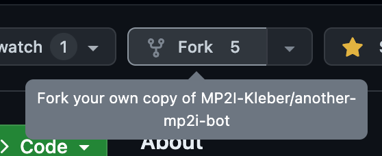

# another-mp2i-bot

  

Ce projet est un bot discord avec divers fonctionnalités bénéfiques aux élèves du lycée Kleber, plus précisément a ceux de la filière MP2I & MPI.

Le language utilisé est le Python (version 3.11 >), basé sur la librairie discord.py.

## Fonctionnalités

Les fonctions marquées de  ne sont utilisable que sur le serveur des MP2I. Si vous invitez le bot sur votre serveur, elles ne seront donc pas utilisable.

Néanmoins, libre a vous de créer un fork du projet, l'héberger vous-même et le configurer pour qu'il fonctionne pour vous 👍.

- envoyer le menu de la cantine
- voir les horaires des bus et trams du réseau CTS
- jouer a un petit jeu "Mot Pour 2 Images"
- souhaiter les anniversaire 
- discuter avec chatGPT 
- changer l'icône de notre serveur selon l'état de la météo au lycée 
- plusieurs petits easter eggs et références à notre classe 

## Contribution

Il est tout a fait possible de contribuer au projet, d'ajouter vos propres idées, vos propres fonctionnalités, aussi inutiles qu'elles soient !

Je m'adresse principalement aux MP2I de Kléber, si vous avez un tant soit peu de connaissance en python, jetez un coup d'œil au code, et demandez-vous si vous ne pouvez pas y ajouter quelque chose 😉

Pour contribuer, le moyen le plus simple est de créer un fork du projet :

Vous pouvez aussi demander l'accès à l'organisation, contactez moi sur Discord: @airo.pi

#### Si vous savez utiliser git :

- faites un clone du projet localement
- faites vos modifications et commits
- ouvrez une Pull Request avec vos modifications

#### Si vous ne connaissez pas git :

- dans vos projets github, allez sur votre fork du projet :
  
- sur la page du projet, changez dans la barre de recherche le lien, modifiant "https://github.**com**/user/another-mp2i-bot/" en "https://github.**dev**/user/another-mp2i-bot/"
- vous pouvez alors faire vos modifications sur un éditeur de code en ligne
- une fois les changements fait, faites un commit de vos changement, puis ouvrez une Pull Request.

N'hésitez pas a me demander sur Discord si vous avez un soucis : @airo.pi

### Tester le code

Pour tester le code, c'est un peu plus délicat.
Le bot peut être facilement exécuté en utilisant Docker.
Dans /src/bot.py, cherchez la liste des extensions chargées, et désactivez toutes celles qui ne vous sont pas utiles.
Ensuite, référez-vous a la section "execution"

## Execution

Le bot est exécuté sous Docker.
Premièrement, faites un fichier `.env` selon le modèle suivant :

```env
CTS_TOKEN=...
BOT_TOKEN=...
OPENWEATHERMAP_API_KEY=...
OPENIA_API_KEY=...
```

_Si vous désactivez des fonctionnalités, les tokens associés ne sont pas requis. Seul `BOT_TOKEN` est impérativement requis._

N'hésitez pas a regarder le fichier `/src/utils/constants.py` et modifiez les constantes en conséquent.
Listez vos anniversaire dans `/resources/personal_informations/` si besoin, suivant l'exemple.
Modifiez `/src/cogs/fun.py` selon votre convenance.

En utilisant Docker, vous pourrez simplement faire :

```
docker compose up
```

Et le bot devrait démarrer.
Sinon une execution python classique est possible.

## Déployer

Copiez le contenu de `deploy/` sur votre serveur. Vous pouvez utiliser l'URL suivante:  
```
https://downgit.github.io/#/home?url=https://github.com/MP2I-Kleber/another-mp2i-bot/tree/master/deploy
```

Modifiez le contenu du `.env`, du `config.toml`, du `compose.yml` selon vos besoins.  
Ces fichiers sont juste donnés en exemples: vous pouvez déployer le bot de la manière que vous souhaitez.  
Par exemple, la partie "webhook" est seulement utile pour de déploiement continue, vous n'en aurez sûrement pas besoin.
